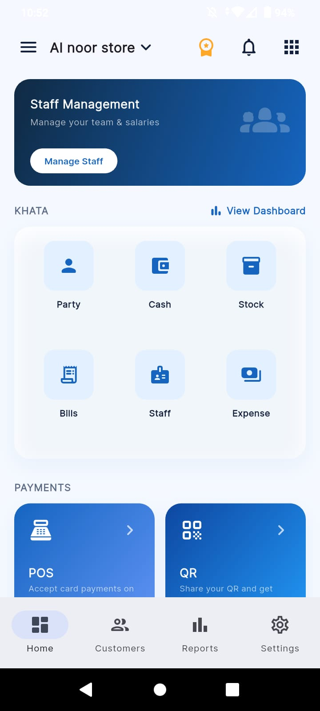
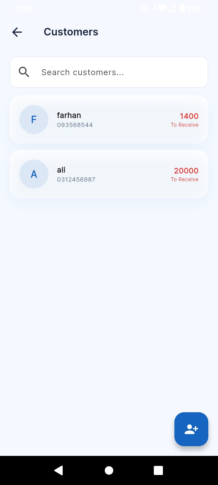
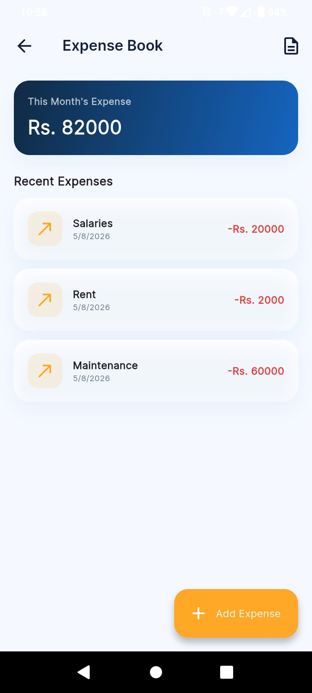
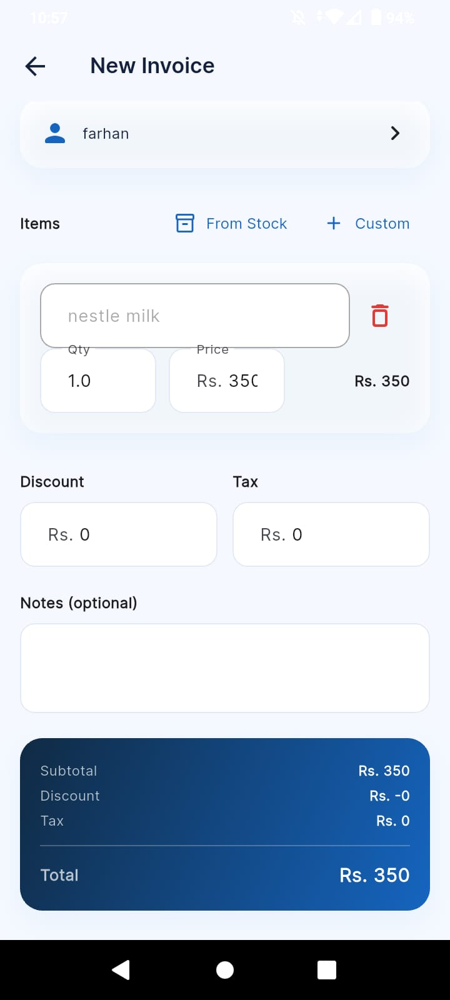
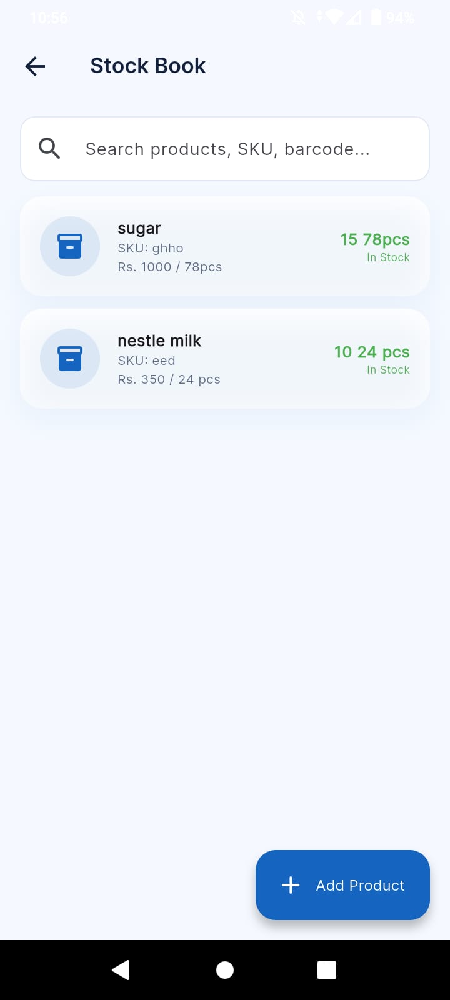
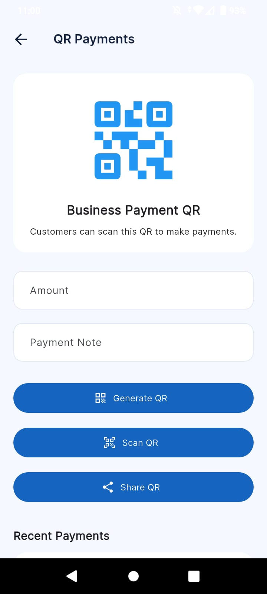

# 💙 BlueKhata – Smart Business Ledger

<p align="center">
  
</p>

<p align="center">
A modern, offline-ready business ledger application built with <b>Flutter</b> and <b>Supabase</b> to help small businesses manage customers, cash flow, inventory, billing, expenses, staff, and financial records from a single platform.
</p>

<p align="center">


</p>

---

# 📱 Overview

BlueKhata is a professional bookkeeping solution designed for shopkeepers, startups, freelancers, and small businesses.

The application allows users to maintain customer ledgers, monitor cash transactions, track inventory, create invoices, manage expenses, organize staff, and monitor business performance through a clean and intuitive interface.

The project follows **Clean Architecture**, **Repository Pattern**, and a **Feature-first structure**, making it highly scalable and production-ready.

---

# ✨ Features

## Authentication

- Phone Authentication
- OTP Login
- Secure Session Management
- Forgot Password
- Language Selection
- Splash Screen

---

## Business Management

- Create Business
- Switch Businesses
- Multi-business Support
- Business Profiles

---

## Dashboard

- Business Overview
- Today's Summary
- Recent Customers
- Quick Actions
- Beautiful Material 3 Interface
- Navigation Dashboard

---

## Customer Management

- Add Customer
- Edit Customer
- Delete Customer
- Customer Ledger
- Customer Details
- Search Customers
- Favourite Customers

---

## Ledger

- Credit Entries
- Debit Entries
- Automatic Balance Calculation
- Running Balance
- Transaction History

---

## Cash Book

- Cash In
- Cash Out
- Cash Reports

---

## Expense Management

- Expense Records
- Expense Categories
- Expense Reports

---

## Inventory

- Product Management
- Stock Records
- Product Details

---

## Billing

- Invoice Creation
- Invoice Details
- Invoice List

---

## Staff Management

- Employee Management
- Attendance
- Staff Details

---

## Utilities

- Business Calculator
- QR Payment Screen
- Settings
- Coming Soon Framework

---

## Built-in Architecture

- Feature-first Architecture
- Repository Pattern
- Riverpod State Management
- GoRouter Navigation
- Material 3 Design
- Supabase Backend
- Hive Local Storage
- Offline-ready Structure

---

# 🛠 Tech Stack

| Technology | Purpose |
|------------|----------|
| Flutter | Cross-platform Framework |
| Dart | Programming Language |
| Supabase | Backend & Authentication |
| PostgreSQL | Database |
| Riverpod | State Management |
| GoRouter | Navigation |
| Hive | Local Storage |
| Material 3 | UI Design |

---

# 📂 Project Structure

```
lib
│
├── core
│   ├── config
│   ├── routes
│   ├── services
│   ├── shared
│   └── theme
│
├── features
│   ├── authentication
│   ├── business
│   ├── dashboard
│   ├── customers
│   ├── ledger
│   ├── cashbook
│   ├── expense
│   ├── stock
│   ├── billing
│   ├── staff
│   ├── settings
│   ├── calculator
│   └── qr
│
└── main.dart
```

---

# 🖼 Application Screens

## Dashboard

```

```

---

## Customers

```

```

---

---

## Expense

```

```

---

## invoice

```

```

---

## Billing

```

```

---


## stock
```

```

---

## Settings

```

```

---

## Calculator

```

```

---

## QR Payments

```

```

---

# ⚙ Getting Started

## Clone Repository

```bash
git clone https://github.com/USERNAME/BlueKhata.git
```

---

## Install Packages

```bash
flutter pub get
```

---

## Configure Supabase

Update your configuration with:

- Project URL
- Anonymous Key

---

## Run Application

```bash
flutter run
```

---

## Build APK

```bash
flutter build apk --release
```

---

# Database

Supabase is used as the backend.

Features include:

- Authentication
- PostgreSQL Database
- Row Level Security
- Realtime Support
- SQL Migrations

---

# Future Improvements

- Barcode Scanner
- PDF Invoice Export
- Reports & Analytics
- Firebase Notifications
- Backup & Restore
- Multi-language Support
- Dark Mode Customization
- Business Card Generator
- Flutter Web Admin Panel

---

# Powered By

**Zenvyro Labs**

---

# Author

**Qurat Ul Ain**

BS Information Technology

Flutter Developer • UI/UX Designer

---

# License

This project is intended for educational and portfolio purposes.
